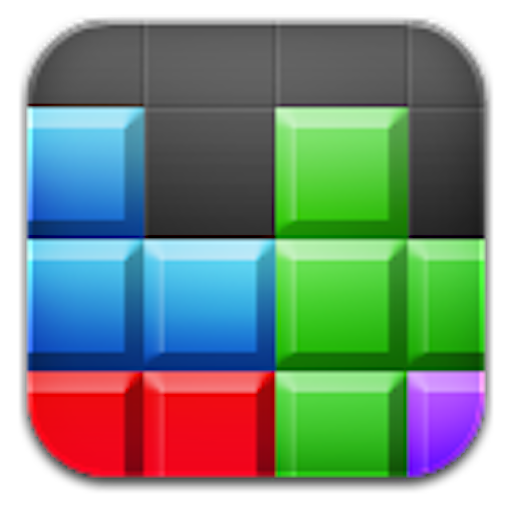
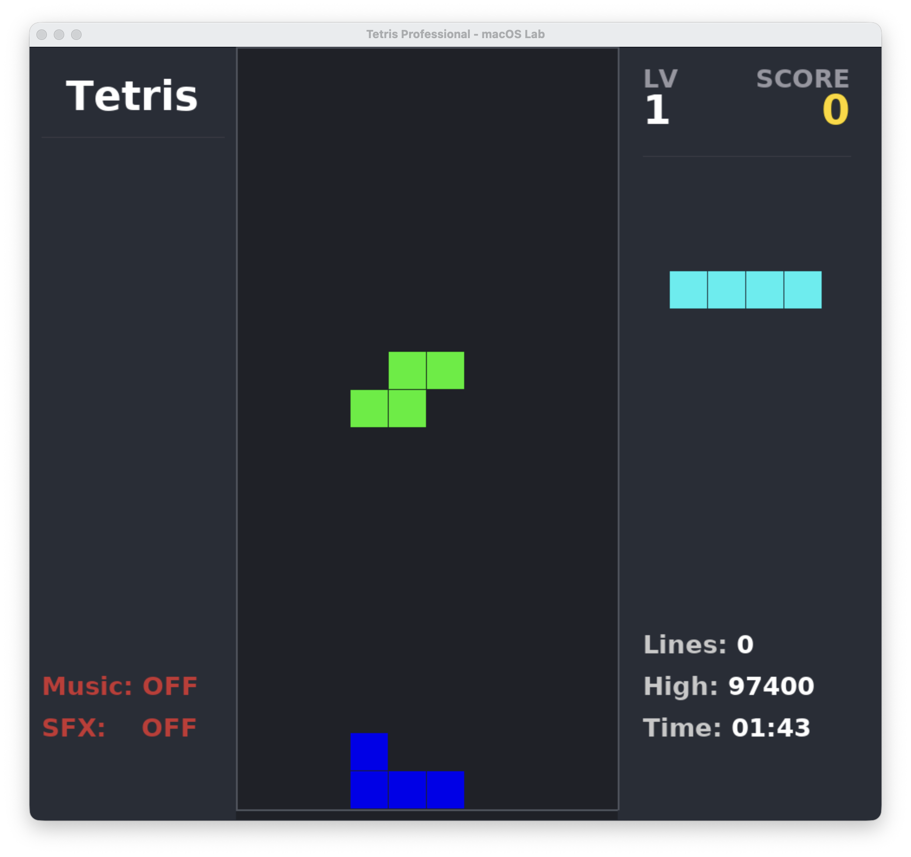
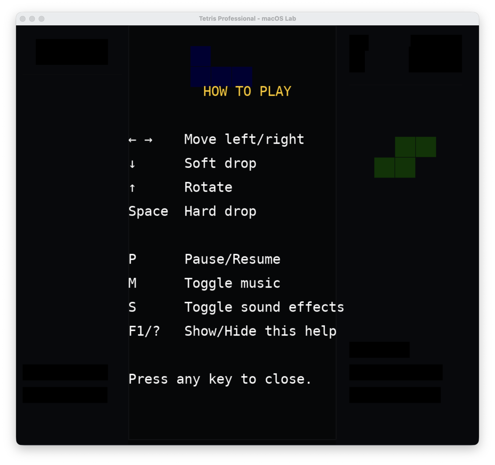

# MyTetris

 A clean, object-oriented implementation of the classic falling block game, built with Python and `pygame`.

[](https://github.com/tlyx/mytetris/actions)
[](https://github.com/tlyx/mytetris/releases/latest)
[](#macos-gatekeeper-troubleshooting)
[](#prerequisites)
[](#prerequisites)

---

## 🎮 Preview

| Main Game Stage | How to Play Menu |
| :---: | :---: |
|  |  |

## Features

*   **Classic Gameplay**: Includes all 7 standard tetrominoes with rotation, wall‑kick, and collision detection.
*   **Modular Architecture**: Clean separation between game engine logic (`TetrisEngine`) and application framework (`TetrisApp`).
*   **Dynamic Difficulty**: Speed increases as you level up (every 10 lines).
*   **Smooth Rendering**: Built for 60 FPS performance with hardware‑accelerated surfaces.
*   **Intuitive UI**:
    *   Real‑time score, level, and lines cleared display.
    *   Next‑piece preview.
    *   Ghost piece (landing preview) with toggle (G key).
    *   Game‑over overlay with restart prompt.
    *   Pause/Resume screen.
    *   Quit‑confirmation dialog.
*   **Resizable Window**: The game scales automatically to any window size (minimum 400×400), keeping a crisp, centered view.
*   **Audio**:
    *   Background music with toggle (M key).
    *   Sound effects for line clears and game over, with toggle (S key).
*   **High Score Persistence**: Best score is saved automatically across sessions.
*   **Auto‑play Bot**: Let the computer play the game automatically with a toggleable AI player (press A).

## Prerequisites

*   Python 3.x
*   [uv](https://github.com/astral-sh/uv) (for dependency management)

## Setup

1.  Clone the repository:
    ```bash
    git clone https://github.com/tlyx/mytetris.git
    cd mytetris
    ```

2.  Sync dependencies:
    ```bash
    uv sync
    ```

## Usage

Run the game using:
```bash
uv run main.py
```

## macOS Gatekeeper Troubleshooting

To try the pre-compiled version on your Apple Silicon Mac, you can [Download the Latest Release](https://github.com/tlyx/mytetris/releases/latest). If you prefer to run it from source, please refer to the same instructions as Linux and Windows in the [Setup](#setup) and [Usage](#usage) sections.

Since this application is bundled with an ad-hoc signature (not signed with a paid Apple Developer account), macOS Gatekeeper will block it upon first launch from the `.dmg`, showing a warning that the developer cannot be verified and only giving options to "Cancel" or "Move to Trash".

To bypass this restriction, close the warning dialog and choose **one** of the following methods:

### Method 1: The Right-Click Shortcut (Admin Accounts)
1. Drag `mytetris.app` into your `Applications` folder.
2. Hold the **Control key**, **right-click** the app, and select **Open**.
3. In the new confirmation dialog that appears, click **Open**.
   *(Note: This option might be hidden if you are currently logged into macOS as a standard/non-admin user).*

### Method 2: System Settings Override (Standard & Admin Users)
1. Double-click the app to let macOS trigger the initial block, then click **Cancel**.
2. Open your Mac's **System Settings** and navigate to **Privacy & Security**.
3. Scroll down to the **Security** section. You will see a note stating: *"mytetris.app" was blocked from opening because it is not from an identified developer.*
4. Click the **Open Anyway** button next to it, authenticate with your password or Touch ID, and the game will launch normally from now on.

### Method 3: The Terminal Way (For Geeks)
If you prefer the command line, you can completely strip the macOS quarantine flag by running the following command in your terminal:
```bash
# Change path to ~/Applications/mytetris.app if installed locally
xattr -cr /Applications/mytetris.app
```

## Controls

| Key              | Action                        |
|------------------|-------------------------------|
| ← / →            | Move piece left / right       |
| ↓                | Soft drop (accelerate)        |
| ↑                | Rotate piece                  |
| P                | Pause / Resume                |
| Space            | Hard drop(instantly to bottom)|
| G                | Toggle ghost piece            |
| Esc              | Toggle quit confirmation      |
| Return (Enter)   | Restart game (on Game Over)   |
| M                | Toggle background music       |
| S                | Toggle sound effects          |
| F1 / ?           | Toggle help                   |
| A                | Toggle auto‑play bot          |

## License

This project is licensed under the MIT License - see the [LICENSE](LICENSE) file for details.
